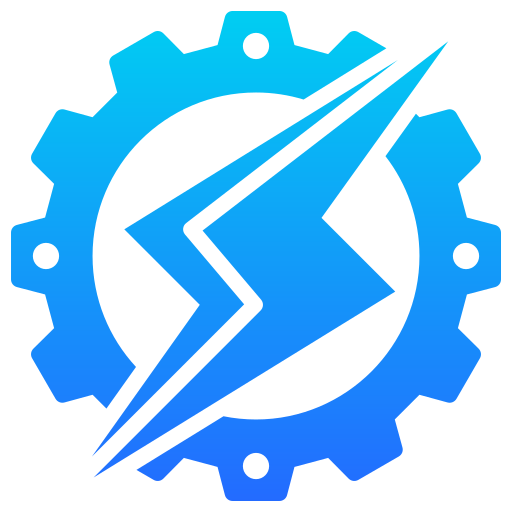

# Kaio Henrique 

**Electrical Engineering Student**

Me chamo Kaio Henrique, sou estudante de Engenharia Elétrica na UFAC e apaixonado por tecnologia. Atualmente, estou focado em projetos de computação quântica, sistemas elétricos e desenvolvimento de softwares, explorando a interseção entre a engenharia, a programação e sistemas embarcados.

### 🤖 Contatos

&nbsp;&nbsp;&nbsp;&nbsp;
 
 

---

### 🤖 Linguagens e Tecnologias

 
 

    
          